[English](#-3d-asset-production-portfolio-stylized--psx-retro-style) | [中文版](#-3d模型作品集-low-poly复古与psx风格) | [Русская версия](#-портфолио-3d-моделей-стилизация-и-ретро-стиль-psx)

---

# 🎨 3D Asset Production Portfolio (Stylized & PSX Retro Style)

Welcome to my 3D computer graphics portfolio. This repository is a curated collection of original 3D models and assets designed for specific game projects and digital environments. All assets are modeled, unwrapped, and textured from scratch using Blender according to each game's unique technical requirements and art direction.

---

## 🛠️ Featured Game Assets & Projects

### 👾 PSX Retro-Style Horror Project
These models were custom-built for a collaborative indie horror game project that I am developing with a friend. The goal was to strictly replicate the nostalgic aesthetic of late-90s console games (PlayStation 1 era). To achieve this efficiently, we combined low-poly geometry with custom textures and an **in-engine pixelation shader effect** to simulate retro screen rendering, vertex jitter, and low-resolution fidelity:

*   **The "Overcharge" Battery:** A crucial technical prop for the horror game. It utilizes a highly optimized low-poly mesh combined with a detailed texture map that simulates realistic surface wear, scratches, rust, and retro graphic decals.
    
    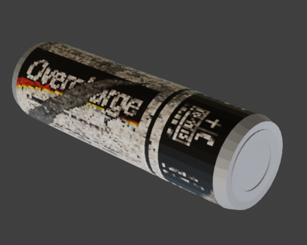 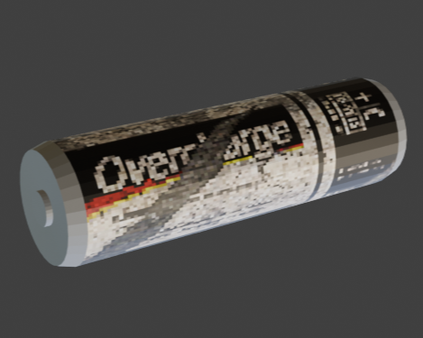

*   **Storage Racks (Shelves):** Environmental structural props created with optimized topology. Designed specifically to work with our dynamic pixel shader, allowing the geometric edges and custom surface textures to correctly render with a retro, aliased PSX look.
    
    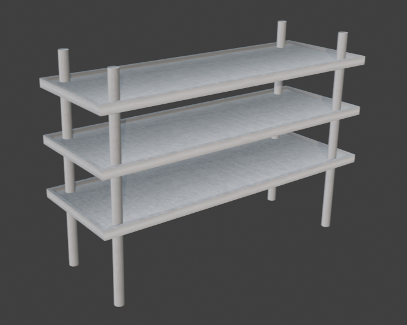 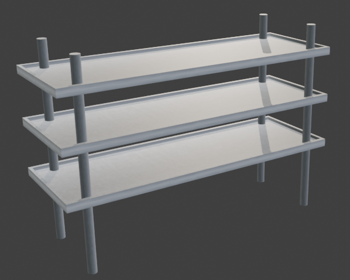

---

### 🔹 Flat Stylized & Minimalist Game Prototypes
These assets were designed for separate arcade and exploratory game prototypes. The technical focus here was on clean minimalist geometry, solid-color shading, and bright, distinct silhouettes:

*   **Alien Character:** A stylized character mesh designed with balanced proportions, optimized for simple rigging and animation.
    
    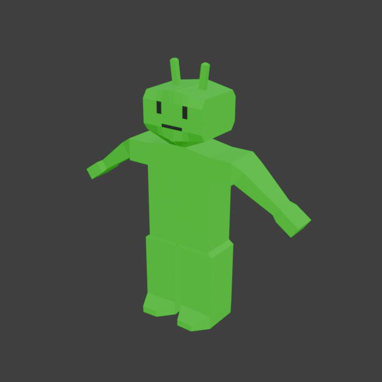 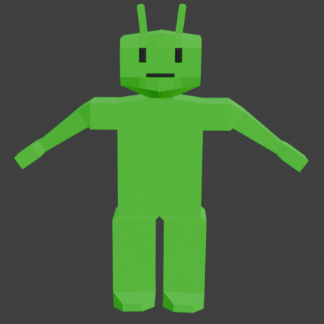 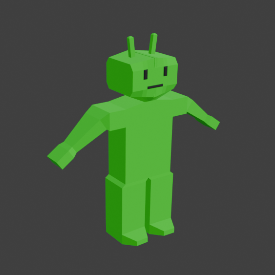

*   **Arcade Karting Vehicle:** A compact vehicle model featuring modular parts and clean geometric forms for an arcade racing prototype.
    
    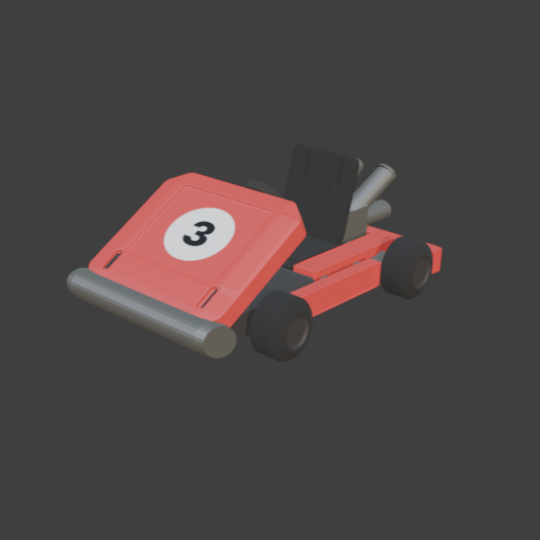 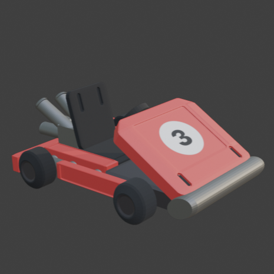 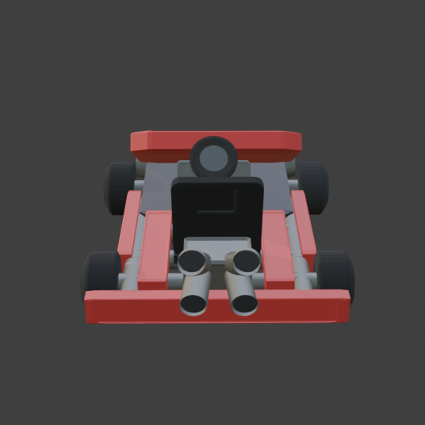

*   **Gaming Console:** A handheld structural and electronic environment prop utilizing optimized shapes, distinct silhouettes, and clean bevels.
    
    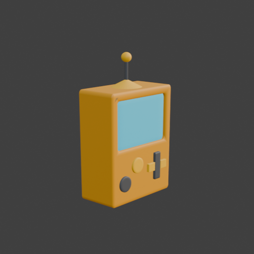 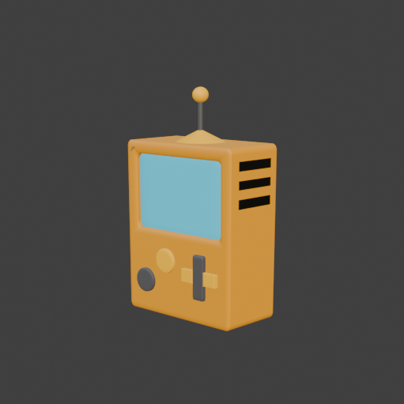

*   **Tableware (Plate & Spoon):** Everyday environment props focusing on clean cylindrical topology and smooth shading.
    
    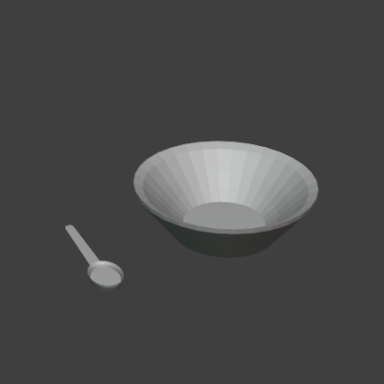 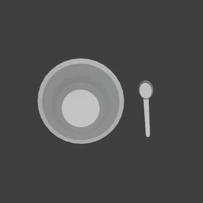 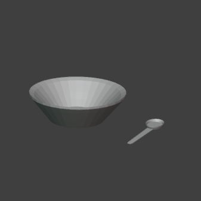

---

## 💻 Technical Standards & Toolchain

*   **Primary Software:** Blender (Modeling, UV Unwrapping, Texture Mapping, Rendering)
*   **Production Context:** Asset creation based on strict project constraints, utilizing hybrid pipelines (Hand-crafted PSX textures + Real-time In-Engine Pixel Shaders).
*   **Workflow Guidelines:** Strict polygon budgets, clean quad-dominant topology, dynamic shading readiness, and proper pivot point alignment for seamless game engine integration.

### 🛠️ Tools
*   **Design:** Blender

---

## 🔒 Copyright

© 2023–2026 Akbarov Damir. All rights reserved.

This project and all its visual assets (3D models, textures, renders, and designs) were created using Blender and are for portfolio demonstration purposes only. Unauthorized copying, modification, or commercial use of these materials without the author's express written permission is strictly prohibited.

---
---

# 🎨 3D模型作品集 (Low-Poly复古与PSX风格)

欢迎来到 my 3D 计算机图形作品集。本仓库展示了一系列为特定游戏项目 and 数字环境量身定制的原创 3D 模型与资产。所有资产均在 Blender 中从零开始进行建模、展 UV 和纹理制作，严格符合每个独立游戏项目的技术指标与美术方向。

---

## 🛠️ 游戏模型与项目展示

### 👾 PSX复古风格恐怖游戏项目
这些模型是专为我和朋友共同开发的独立恐怖游戏（Indie Horror Game）量身定制的。我们的核心目标是完美复刻 90 年代末经典主机游戏（PlayStation 1 时代）的低模视觉效果。为了高效实现这一风格，我们采用了**低多边形网格（Low-Poly）结合定制纹理**的技术方案，并在游戏引擎端应用了**实时像素化着色器（Pixelation Shader）**，以模拟复古屏幕渲染、顶点抖动（Vertex Jitter）和低分辨率的独特色彩氛围：

*   **“Overcharge” 蓄电池：** 恐怖游戏中的核心互动道具。模型将高度优化的低多边形网格与细腻的低分辨率纹理贴图相结合，完美呈现出真实的表面磨损、划痕、生锈效果以及复古图案标签（Decal）。
    
     

*   **工业置物架（货架）：** 具备高度优化拓扑结构的场景环境组件。它们专为配合我们的动态像素化着色器而设计，使网格边缘与定制表面纹理在实时渲染中能够呈现出 PSX 时代经典的抗锯齿和像素化颗粒感。
    
     

---

### 🔹 扁平化风格与极简主义游戏原型
这些资产专为其他独立开发的街机及探索类游戏原型设计。技术核心在于干净利落的极简几何结构、纯色色块渲染以及鲜明独特的剪影特征：

*   **外星人角色 (Alien)：** 具备科学形体比例的风格化角色网格模型，针对骨骼绑定（Rigging）和有机构造的动画进行了全面优化。
    
      

*   **街机卡丁车 (Arcade Karting)：** 用于赛车游戏原型的紧凑型载具模型，采用模块化部件组合，具备极其干净的几何外观。
    
      

*   **掌上游戏机 (Gaming Console)：** 便携式电子设备环境道具，具备优化的器形结构、清晰的剪影和极其精细的倒角（Bevel）处理。
    
     

*   **餐具（盘子与勺子）：** 基础生活化环境小道具，专注于规律的圆柱形拓扑结构（Cylindrical Topology）与平滑着色（Smooth Shading）的表现。
    
      

---

## 💻 技术指标与核心工具

*   **核心软件：** Blender (建模、UV 展开、材质分配、渲染)
*   **开发背景：** 在严格的硬件和引擎管线限制下创建资产（复古 PSX 风格 vs 现代低多边形极简风格）。
*   **工艺标准：** 严格的四边形拓扑网格（Quad-dominant Topology），精准的面数预算控制（Polygon Budget），针对低分辨率纹理进行战略性 UV 缝合线布局（Seam Placement），以及完美校准的轴心点（Pivot Points），确保无缝导出至游戏引擎。

### 🛠️ Tools
*   **Design:** Blender

---

## 🔒 版权声明 (Copyright)

© 2023–2026 Akbarov Damir. 保留所有权利。

本项目及其包含的所有视觉资产（包括 3D 模型、纹理贴图、渲染图及美术设计）均使用 Blender 独立创作，仅用于作品集展示目的。未经作者书面明确授权，严禁对 these 材料进行任何形式的擅自复制、修改、二次分发或用于商业用途。

---
---

# 🎨 Портфолио 3D-моделей (Стилизация и ретро-стиль PSX)

Добро пожаловать в мое портфолио 3D-графики. Этот репозиторий представляет собой коллекцию оригинальных 3D-моделей и ассетов, созданных для конкретных игровых проектов и цифровых сред. Все ассеты смоделированы, развернуты и текстурированы с нуля в Blender в соответствии с техническими требованиями и арт-дирекцией каждой отдельной игры.

---

## 🛠️ Представленные игровые модели и проекты

### 👾 Хоррор-проект в ретро-стиле PSX
Эти модели были созданы специально для совместного инди-хоррора, который я разрабатываю вместе с другом. Нашей целью было в точности воссоздать ностальгическую эстетику игр конца 90-х годов (эпохи PlayStation 1). Чтобы сделать это эффективно, мы объединили низкополигональную геометрию с кастомными текстурами и **пиксельным шейдер-эффектом на стороне игрового движка**, который имитирует ретро-рендеринг экрана, дрожание вершин и графику низкого разрешения:

*   **Батарейка «Overcharge»:** Ключевой интерактивный предмет для хоррора. Модель сочетает в себе оптимизированную low-poly сетку с детализированной текстурой, которая имитирует реалистичный износ поверхности, царапины, ржавчину и ретро-декали.
    
     

*   **Стеллажи (Полки):** Конструктивные элементы окружения с оптимизированной топологией. Они создавались специально под работу с нашим динамическим пиксельным шейдером, благодаря чему геометрические грани и кастомные текстуры поверхностей правильно рендерятся с характерным для PSX ретро-эффектом.
    
     

---

### 🔹 Прототипы стилизованных и минималистичных игр
Эти ассеты создавались для отдельных аркадных и исследовательских игровых прототипов. Технический фокус здесь был сделан на чистой минималистичной геометрии, заливке сплошным цветом и ярких, выразительных силуэтах:

*   **Персонаж-инопланетянин (Alien):** Стилизованная сетка персонажа с выверенными пропорциями, оптимизированная для простого риггинга и анимации.
    
      

*   **Гоночный карт (Arcade Karting):** Компактная модель автомобиля, состоящая из модульных частей и чистых геометрических форм для прототипа аркадных гонок.
    
      

*   **Игровая консоль (Gaming Console):** Портативный проп окружения с оптимизированной формой, четким силуэтом и аккуратными фасками.
    
     

*   **Посуда (Tableware - Plate & Spoon):** Базовые бытовые предметы окружения с правильной цилиндрической топологией и сглаженным отображением (smooth shading).
    
### 🛠️ Tools
*   **Design:** Blender

---

## 🔒 Авторские права

© 2023–2026 Акбаров Дамир. Все права защищены.

Этот проект и все его визуальные ассеты (3D-модели, текстуры, рендеры и дизайн) созданы в Blender и предназначены исключительно для демонстрации портфолио. Несанкционированное копирование, модификация или коммерческое использование данных материалов без явного письменного разрешения автора строго запрещены.
